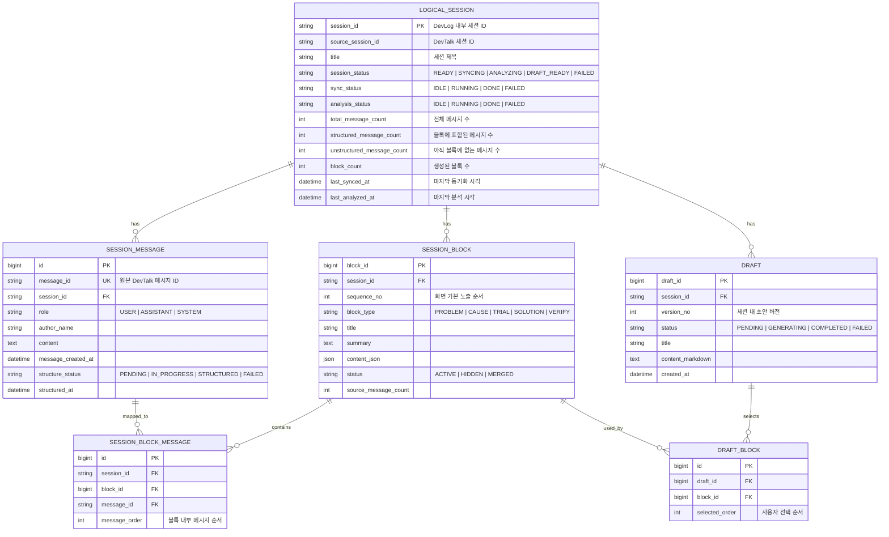

# DevLog ERD

## 개요
`concept-c` 기준의 화면 흐름을 받치려면 DevLog의 DB도 단순 저장 구조가 아니라 `동기화 상태`, `분석 진행 상태`, `블록 선택 이력`, `초안 생성 버전`을 설명할 수 있어야 한다.

기존 `logical_session -> synced_message/session_block/draft` 중심 구조는 저장은 가능하지만, 아래 상태를 표현하기에는 부족하다.

- 아직 블록으로 구조화되지 않은 메시지 여부
- 분석이 진행 중인지, 완료되었는지 여부
- 사용자가 어떤 블록을 어떤 순서로 골랐는지
- 초안이 재생성 가능한 버전 구조인지

이 문서는 `concept-c` 기준으로 개편된 목표 ERD를 정리한다.

## 핵심 변경점
- `synced_message`를 `session_message`로 재정의한다.
- `session_block_message`를 추가해 메시지와 블록의 매핑을 저장한다.
- `draft_block`을 추가해 사용자가 선택한 블록과 선택 순서를 저장한다.
- `logical_session`을 집계와 상태를 가진 루트 엔티티로 확장한다.
- `draft`는 세션당 단일 결과물이 아니라 버전 가능한 초안 엔티티로 다룬다.

## Mermaid ERD

## 화면과 연결되는 해석
- 홈 화면은 `logical_session`의 집계 컬럼만으로 세션 목록을 구성한다.
- 세션 상세의 분석 오버레이는 `sync_status`, `analysis_status`, `unstructured_message_count`를 기준으로 노출한다.
- 블록 선택 가능 상태는 `analysis_status = DONE` 이고 `unstructured_message_count = 0` 인 시점이다.
- 초안은 `draft` 본문만 저장하는 것이 아니라 `draft_block`에 남은 선택 이력까지 포함해야 복원 가능하다.

## 참고
이 ERD는 `concept-c`의 흐름인 `분석 중 -> 블록 선택 -> 글 생성`을 데이터 모델에서 그대로 드러내기 위한 목표안이다. 선택 이유와 후속 작업은 [docs/adr/ADR-006-concept-c-DB구조-개편.md](/D:/project_univ/warruru-lab/devlog/docs/adr/ADR-006-concept-c-DB구조-개편.md)에 정리한다.
